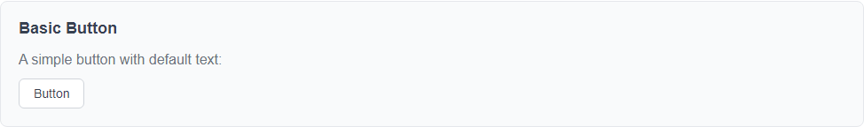
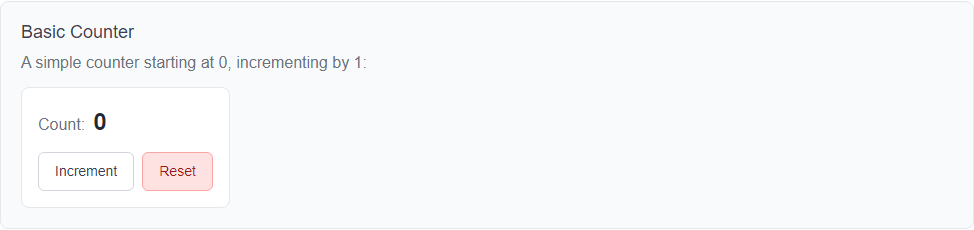

# LmComponents - Component Quick Reference

**READ THIS FIRST**: This file provides a quick overview of all available components. Use this to understand the component landscape without loading full documentation into your context.

For detailed information about any component, follow the documentation link.

---

## How to Use This File

1. **Scan component summaries** to find what you need
2. **Check dependencies** to understand component relationships
3. **Follow documentation links** when you need detailed information
4. **Update this file** whenever you add, modify, or remove components (see CONTRIBUTING.md for rules)

---

## Visual Quick Reference

**Screenshot Policy**: All components, current and future, MUST include screenshots in their documentation. This provides:
- Quick visual reference to see what components look like without running code
- Immediate understanding of component appearance and behavior
- LLM-friendly context for understanding component structure

Each component below includes an overview screenshot. For detailed feature screenshots, see the component's full documentation.

---

## Available Components

*Components will be added here as they are implemented. Each entry follows this format:*

```
### ComponentName
- **Purpose**: Brief one-line description
- **Dependencies**: [OtherComponent](#othercomponent), [AnotherComponent](#anothercomponent), or "None"
- **Documentation**: [Full Documentation](docs/namespace/ComponentName.Md)
```

---

## Component Index

### LmButton



- **Purpose**: Simple button component with customizable text and click handling
- **Dependencies**: None
- **Documentation**: [Full Documentation](docs/LmComponents.Components/Button.Md)

### LmCounter



- **Purpose**: Counter component that tracks and displays click count with increment and reset functionality
- **Dependencies**: [LmButton](#lmbutton)
- **Documentation**: [Full Documentation](docs/LmComponents.Components/Counter.Md)

<!--
When adding components, maintain alphabetical order and use the format above.
Remember: Every code change to a component requires updating both this file and the detailed documentation.
-->
