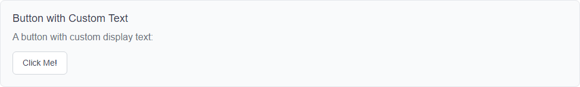
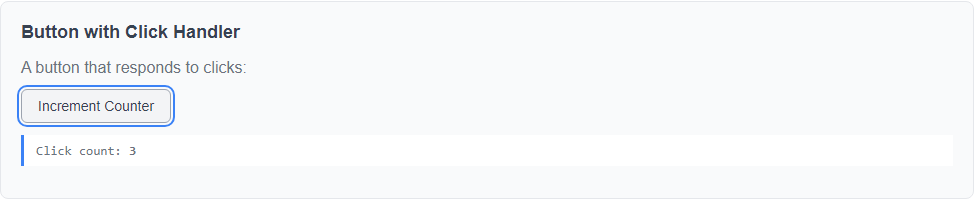
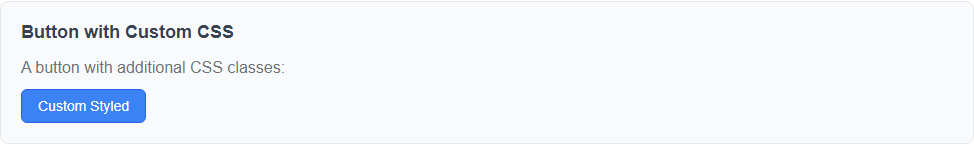

# LmButton Component

**Namespace**: `LmComponents.Components`
**File**: `src/LmComponents.Components/Button/LmButton.razor`

## Overview

LmButton is a simple, reusable button component that wraps standard HTML button functionality with consistent styling and a clean API. It serves as a foundational component for building more complex interactive elements.

## Purpose

Provides a standardized button implementation with:
- Consistent visual styling
- Event handling through EventCallback
- Customizable appearance via CSS classes
- Clean, predictable API

## Dependencies

**None** - This is a foundational component with no dependencies on other LmComponents.

## Visual Preview

Below are screenshots demonstrating the various features and configurations of the LmButton component:

### Basic Button

*A simple button with default text*

### Custom Text

*Button with custom display text*

### Click Handler

*Interactive button responding to clicks, showing click count*

### Custom Styling

*Button with additional CSS classes applied*

### Async Operation

*Button handling asynchronous operations with status display*

## Parameters

### Text
- **Type**: `string`
- **Default**: `"Button"`
- **Required**: No
- **Description**: The text displayed on the button

### OnClick
- **Type**: `EventCallback`
- **Default**: Empty callback
- **Required**: No
- **Description**: Event callback invoked when the button is clicked. Use this to handle button click events in parent components.

### CssClass
- **Type**: `string?`
- **Default**: `null`
- **Required**: No
- **Description**: Additional CSS classes to apply to the button element. These are appended to the default `lm-button` class.

## Events

### OnClick
Triggered when the user clicks the button. The component uses `EventCallback` which automatically handles async operations and component state updates.

## Styling

The component includes scoped CSS in `LmButton.razor.css` that provides:
- Default styling with neutral colors
- Hover state for visual feedback
- Active state with subtle animation
- Focus outline for accessibility
- Responsive transitions

### CSS Classes

- `lm-button`: Base class applied to all button instances
- Custom classes: Any additional classes provided via the `CssClass` parameter

## Usage Examples

### Basic Usage
```razor
<LmButton Text="Click Me" />
```

### With Click Handler
```razor
<LmButton Text="Submit" OnClick="HandleSubmit" />

@code {
    private void HandleSubmit()
    {
        // Handle button click
    }
}
```

### With Custom CSS Class
```razor
<LmButton Text="Primary Action" CssClass="primary-button" />
```

### Async Click Handler
```razor
<LmButton Text="Save" OnClick="SaveDataAsync" />

@code {
    private async Task SaveDataAsync()
    {
        await Task.Delay(1000);
        // Save data
    }
}
```

## Component Structure

```
Button/
├── LmButton.razor        # Component markup and code
└── LmButton.razor.css    # Scoped styles
```

## Implementation Notes

### Event Handling
The component uses `EventCallback` rather than `Action` or `Func<Task>` because:
- `EventCallback` automatically triggers UI updates after execution
- It provides better integration with Blazor's rendering system
- It supports both sync and async handlers seamlessly

### Styling Approach
Uses Blazor's scoped CSS feature, which:
- Prevents style conflicts with other components
- Keeps styles co-located with component logic
- Allows easy customization through the `CssClass` parameter

### Accessibility
The component maintains standard button semantics:
- Uses native `<button>` element for proper keyboard navigation
- Includes focus styles for keyboard users
- Maintains semantic HTML for screen readers

## Integration with Other Components

LmButton is designed to be composed into other components. See:
- **LmCounter**: Uses LmButton for increment functionality

## Testing Considerations

When testing components that use LmButton:
- Test click event handling with bUnit's `Click()` method
- Verify CSS class application
- Test async click handlers properly await completion
- Verify button text renders correctly

## Future Enhancements

Potential improvements (not currently implemented):
- Disabled state support
- Loading state with spinner
- Button variants (primary, secondary, danger, etc.)
- Size variants (small, medium, large)
- Icon support

---

**Last Updated**: 2025-12-10
**Version**: 1.0.0
