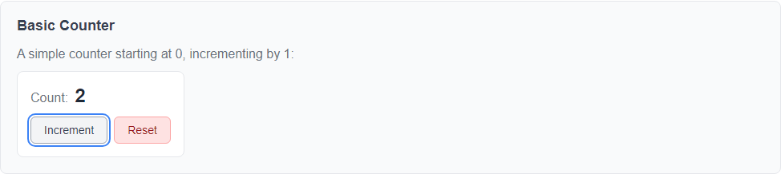
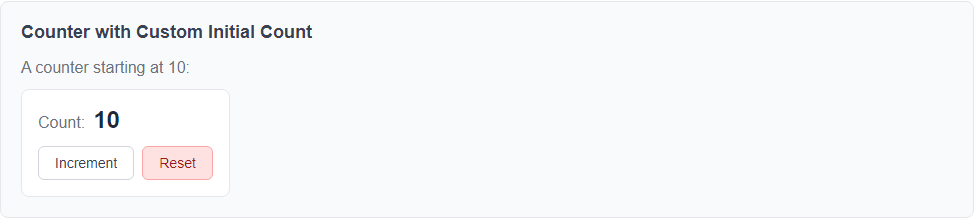
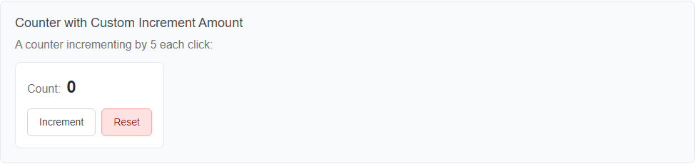
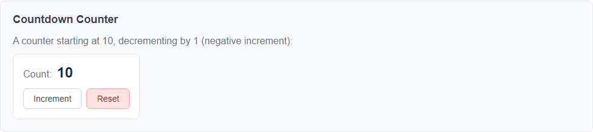
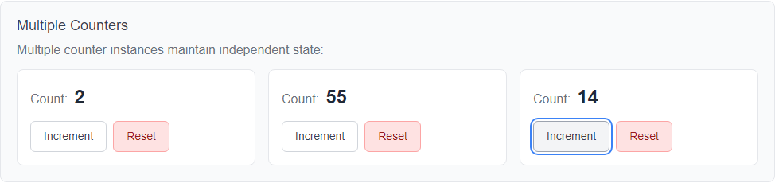

# LmCounter Component

**Namespace**: `LmComponents.Components`
**File**: `src/LmComponents.Components/Counter/LmCounter.razor`

## Overview

LmCounter is a stateful component that displays a numeric counter with increment and reset functionality. It demonstrates component composition by using LmButton for its interactive elements.

## Purpose

Provides a reusable counter implementation with:
- Visual display of current count
- Increment functionality using configurable increment amount
- Reset functionality to return to initial value
- Clean, self-contained UI
- Demonstrates component composition patterns

## Dependencies

**LmButton** - Used for both the increment and reset buttons. The counter component composes two LmButton instances to provide its interactive functionality.

## Visual Preview

Below are screenshots demonstrating the various features and configurations of the LmCounter component:

### Basic Counter

*A simple counter starting at 0, incrementing by 1*

### Custom Initial Count

*Counter starting at a custom value (10)*

### Custom Increment Amount

*Counter incrementing by a custom amount (5)*

### Countdown Counter

*Counter with negative increment, counting down from 10*

### Multiple Independent Instances

*Multiple counter components maintaining independent state*

## Parameters

### InitialCount
- **Type**: `int`
- **Default**: `0`
- **Required**: No
- **Description**: The starting value for the counter. When the reset button is clicked, the counter returns to this value.

### IncrementAmount
- **Type**: `int`
- **Default**: `1`
- **Required**: No
- **Description**: The amount by which the counter increases each time the increment button is clicked. Can be positive or negative.

## Component Behavior

### Initialization
When the component is created, it sets the current count to the `InitialCount` value via the `OnInitialized` lifecycle method.

### Increment Action
Clicking the "Increment" button adds the `IncrementAmount` to the current count. This operation can increase or decrease the count depending on whether `IncrementAmount` is positive or negative.

### Reset Action
Clicking the "Reset" button returns the counter to its `InitialCount` value, regardless of the current count.

## Styling

The component includes scoped CSS in `LmCounter.razor.css` that provides:
- Flexbox layout for display and actions
- Styled counter display with label and value
- Visual distinction for the counter value (larger, bold)
- Tabular number formatting for consistent digit width
- Custom styling for the reset button (red tones)
- Gap spacing between elements

### CSS Classes

- `lm-counter`: Container class for the entire component
- `counter-display`: Container for the count label and value
- `counter-label`: The "Count:" text label
- `counter-value`: The numeric counter value
- `counter-actions`: Container for the button group
- `reset-button`: Custom styling applied to the reset button via LmButton's `CssClass` parameter

## Usage Examples

### Basic Usage
```razor
<LmCounter />
```
Creates a counter starting at 0, incrementing by 1.

### Custom Initial Count
```razor
<LmCounter InitialCount="10" />
```
Creates a counter starting at 10.

### Custom Increment Amount
```razor
<LmCounter IncrementAmount="5" />
```
Creates a counter that increments by 5 each click.

### Both Parameters
```razor
<LmCounter InitialCount="100" IncrementAmount="10" />
```
Creates a counter starting at 100, incrementing by 10.

### Decrement Counter
```razor
<LmCounter InitialCount="10" IncrementAmount="-1" />
```
Creates a countdown counter starting at 10, decrementing by 1.

## Component Structure

```
Counter/
├── LmCounter.razor        # Component markup and code
└── LmCounter.razor.css    # Scoped styles
```

## Implementation Notes

### State Management
The component manages its own internal state (`currentCount`) and does not expose it as a parameter. This makes it a controlled component that maintains its own state. If you need external control of the count value, consider adding:
- A `Count` parameter with two-way binding (`@bind-Count`)
- An `OnCountChanged` event callback

### Component Composition
LmCounter demonstrates best practices for component composition:
- Reuses LmButton rather than duplicating button logic
- Passes appropriate parameters to child components
- Uses `CssClass` to customize the appearance of the reset button
- Maintains single responsibility (counting) while delegating button functionality

### Lifecycle
Uses `OnInitialized` to set the initial state. This ensures `currentCount` is properly initialized from the `InitialCount` parameter before the component first renders.

## Integration with Other Components

This component demonstrates how to compose LmComponents:
- **Uses**: LmButton (dependency)
- **Used by**: None yet (can be used in forms, dashboards, etc.)

## Testing Considerations

When testing LmCounter:
- Test that initial count displays correctly
- Test increment behavior with default and custom increment amounts
- Test reset functionality returns to initial count
- Test negative increment amounts (countdown behavior)
- Verify that LmButton components are rendered correctly
- Test button click handlers trigger expected state changes

Example bUnit test structure:
```csharp
var cut = RenderComponent<LmCounter>(parameters => parameters
    .Add(p => p.InitialCount, 5)
    .Add(p => p.IncrementAmount, 2));

// Find and click the increment button
var incrementButton = cut.FindAll("button").First();
incrementButton.Click();

// Verify count increased
cut.Find(".counter-value").TextContent.Should().Be("7");
```

## Future Enhancements

Potential improvements (not currently implemented):
- Two-way binding for count value (`@bind-Count`)
- `OnCountChanged` event callback
- Minimum and maximum count limits
- Decrement button as a separate action
- Custom button text via parameters
- Animation on count change
- Formatting options for the displayed number

## Relationship to Project Goals

LmCounter specifically demonstrates:
- **Component Composition**: Shows how LmComponents build on each other
- **Clear Dependencies**: Explicitly depends on LmButton
- **Self-Documenting**: Parameter names and behavior are intuitive
- **Simple State Management**: Easy to understand state flow

---

**Last Updated**: 2025-12-10
**Version**: 1.0.0
